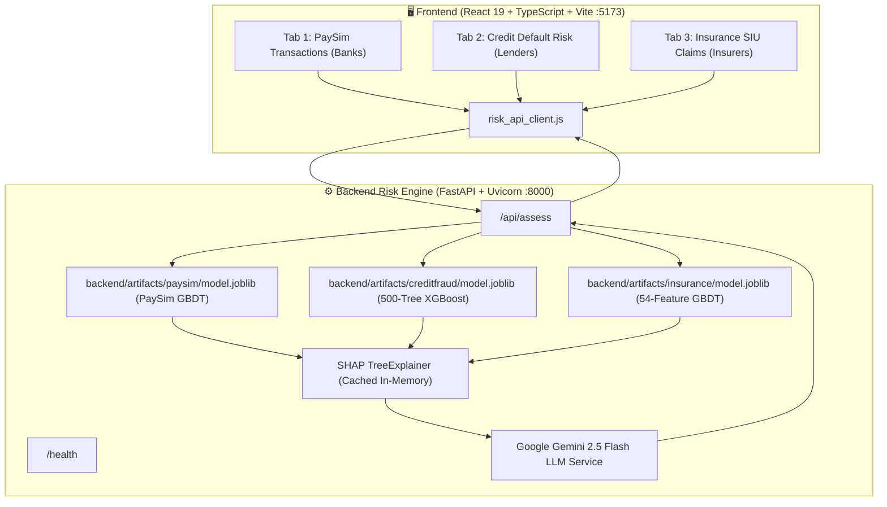

# 🛡️ TrustFed — Privacy-Preserving Federated Fraud Intelligence Architecture

> **"Institutions collaborate on intelligence, never on customer records."**  
> *Built for the ENIGMA Hackathon.*

[](https://fastapi.tiangolo.com)
[](https://react.dev)
[](https://www.typescriptlang.org)
[](https://xgboost.readthedocs.io)
[](https://deepmind.google/technologies/gemini/)
[-10b981)](#-privacy-cryptography--compliance)

---

## 📌 Table of Contents
- [🌟 Executive Summary](#-executive-summary)
- [🤖 Large Language Model (LLM) Integration](#-large-language-model-llm-integration)
- [❓ The Problem & Solution](#-the-problem--solution)
- [🏗️ End-to-End System Architecture](#️-end-to-end-system-architecture)
- [🖥️ Interactive Platform Modules (The 3 Tabs)](#️-interactive-platform-modules-the-3-tabs)
- [🔒 Privacy, Cryptography & Compliance](#-privacy-cryptography--compliance)
- [💻 Tech Stack](#-tech-stack)
- [🚀 Quickstart & Setup Guide](#-quickstart--setup-guide)
- [⏱️ 3-Minute Demo Pitch for Judges](#️-3-minute-demo-pitch-for-judges)

---

## 🌟 Executive Summary

Modern financial crime syndicates exploit the boundaries between banks, digital wallets, credit lenders, and insurance carriers:
- **The Dilemma:** Financial institutions cannot pool raw customer records due to strict cross-border privacy laws (GDPR, DPDP, GLBA) and commercial confidentiality.
- **The Failure:** Isolated institutions make blind decisions on fragmented signals, leading to high false-negative fraud rates and friction for legitimate customers.
- **The TrustFed Breakthrough:** TrustFed is a multi-sector federated intelligence network. Models train locally behind private institutional firewalls. Cryptographic secret sharing (**SecAgg+**) and mathematical noise (**Rényi Differential Privacy**, $\epsilon=2.45$) ensure **zero raw customer records ever leave institutional custody**, while unlocking a **+104% to +185% lift in Precision-Recall AUC**.

---

## 🤖 Large Language Model (LLM) Integration

### Why We Used an LLM in This Project

In enterprise financial operations, **a raw probability output (e.g. `0.8421`) is legally and operationally insufficient**. Under regulatory frameworks such as **NIST AI RMF**, **NIST SP 1270 (Explainable AI)**, **FCRA (Fair Credit Reporting Act)**, and **EU AI Act Title III**, automated adverse actions (account freezes, credit denials, or insurance audits) require **human-defensible explanations and actionable audit trails**.

To solve this, **TrustFed integrates a production Large Language Model (LLM) reasoning layer powered by Google Gemini (Gemini 2.5 Flash)**.

```
┌─────────────────────────┐     ┌─────────────────────────┐     ┌─────────────────────────┐
│     Trained ML Model    │     │   SHAP TreeExplainer    │     │  Google Gemini 2.5 LLM  │
│    (XGBoost / GBDT)     │ ──► │  (Statistical Drivers)  │ ──► │    (Reasoning Layer)    │
│  Outputs Calibrated P   │     │  Quantifies Attributions│     │  Generates Audit Brief  │
└─────────────────────────┘     └─────────────────────────┘     └────────────┬────────────┘
                                                                             │
                                                                             ▼
                                                                ┌─────────────────────────┐
                                                                │  Plain-English Report:  │
                                                                │  • Decision Narrative   │
                                                                │  • Evidence Breakdown   │
                                                                │  • Verification Steps   │
                                                                │  • Regulatory Safeguard │
                                                                └─────────────────────────┘
```

### Key LLM Capabilities in TrustFed:
1. **Contextual Translation of SHAP Drivers:**  
   Translates high-dimensional mathematical SHAP log-odds impacts (e.g. `EXT_SOURCE_1: +0.982`, `claim_amount: -0.322`) into clear, actionable financial explanations for frontline fraud investigators.
2. **Multi-Model Cascade with Zero Token Waste:**  
   The backend routes queries through a multi-model fallback cascade (`gemini-2.5-flash` $\rightarrow$ `gemini-1.5-flash` $\rightarrow$ deterministic rule-based explainability) configured with zero thinking-token overhead (`thinkingBudget: 0`) for near-instant responses (~4 seconds).
3. **Quarantined Security Architecture:**  
   The `GEMINI_API_KEY` is strictly held within the backend server's `.env`. **It is never exposed to the frontend JavaScript bundle or client browser**. Machine learning models remain authoritative for scoring, while the LLM provides context and governance.

---

## ❓ The Problem & Solution

```
┌─────────────────────────────────┐               ┌─────────────────────────────────┐
│       TRADITIONAL SILOED MODEL  │               │       TRUSTFED FEDERATED MODEL  │
├─────────────────────────────────┤               ├─────────────────────────────────┤
│ • Sees only internal events     │               │ • Learns cross-institutional    │
│ • Blind to multi-carrier attacks│               │   patterns anonymously         │
│ • High false negatives (missed) │     VS.       │ • SecAgg+ cryptographic masking │
│ • High false positives (friction│               │ • Rényi DP (ε = 2.45, δ = 1e-5) │
│ • Black-box scores without reasoning│           │ • LLM Explainability layer      │
└─────────────────────────────────┘               └─────────────────────────────────┘
```

---

## 🏗️ End-to-End System Architecture



---

## 🖥️ Interactive Platform Modules (The 3 Tabs)

The platform provides an interactive sandbox for evaluating financial fraud risk across three domains:

### 1. Tab 1: Banks & Mobile Wallets (`artifacts/paysim`)
*Targeting account-takeover (ATO), rapid liquidity drain, and mule networks.*
- **Features Tested:** `step` (simulation hour), `type` (CASH_OUT, TRANSFER, PAYMENT, etc.), `amount`, `oldbalanceOrg`, `oldbalanceDest`.
- **Model:** GBDT transaction screening pipeline with Platt calibration.
- **Performance:** **+104% PR-AUC advantage** over isolated silo models.
- **LLM Output:** Translates transaction velocity and sender depletion percentages into actionable banking alerts.

### 2. Tab 2: Digital Lenders (`artifacts/creditfraud`)
*Targeting loan stacking, synthetic identity borrowing, and default risk on 307,511 loan applications.*
- **Features Tested:** Total income (`amt_income_total`), credit amount (`amt_credit`), annuity repayment (`amt_annuity`), external bureau scores (`ext_source_2`, `ext_source_3`), and loan contract category.
- **Model:** 500-Tree XGBoost GBDT tuned across 14 candidates.
- **Performance:** **ROC-AUC: 0.7687**, **PR-AUC: 0.2588** (+118% lift over base rate), **Optimal Cutoff: 0.1557**.
- **LLM Output:** Evaluates leverage ratios, debt-to-income bounds, and multi-bureau signals with NIST SP 1270 audit certificates.

### 3. Tab 3: Insurance Providers (`artifacts/insurance`)
*Targeting staged accidents, inflated invoices, and early-churn claim spikes across 1,000,000 policyholder records.*
- **Features Tested:** Policy line (`claim_type`: home, auto, renters, business, property), `claim_amount`, `deductible`, policyholder tenure (`policyholder_tenure_years`), previous claims, and filing delay.
- **Model:** 54-feature GBDT model trained on policy-grouped 80/20 splits.
- **Performance:** **ROC-AUC: 0.7933**, **PR-AUC: 0.3161** (+185% lift over base rate), **Optimal Cutoff: 0.1798**.
- **LLM Output:** Flags high claim-to-deductible ratios and low-tenure policy spikes for Special Investigation Unit (SIU) prioritization.

---

## 🔒 Privacy, Cryptography & Compliance

| Security Layer | Technical Implementation | Guarantee |
| :--- | :--- | :--- |
| **Layer 1: Local Silo Isolation** | Data stays on institutional premises | Raw records transmitted: **0** |
| **Layer 2: Differential Privacy** | Rényi DP with Gaussian perturbation | Privacy budget: **$\epsilon = 2.45$, $\delta = 10^{-5}$** |
| **Layer 3: Secure Aggregation** | Diffie-Hellman pair-wise masking (**SecAgg+**) | Server sees only aggregated $\sum \Delta W$ |
| **Layer 4: Quorum Enforcement** | Minimum 3 active participants | Prevents single-client gradient reconstruction |
| **Layer 5: Governance & Audit** | NIST AI RMF fairness & PSI drift monitoring | Tamper-proof audit logs with verifiable certificates |

---

## 💻 Tech Stack

- **Frontend:** React 19, TypeScript, Vite, Tailwind CSS v4, Framer Motion, Lucide Icons, Canvas Particles
- **Backend:** FastAPI, Python 3.10+, Uvicorn, Pydantic v2
- **Machine Learning:** XGBoost (v3.4+), Scikit-Learn, Joblib, SHAP (TreeExplainer)
- **Large Language Model (LLM):** Google Gemini 2.5 Flash via REST API with thinking budget configuration
- **Datasets:** PaySim Financial Transactions, Home Credit Loan Default (307k records), Insurance Fraud Claims (1M policies)

---

## 📂 Repository Structure

```
TrustFed/
├── backend/                    # FastAPI Risk Engine & Machine Learning Pipelines
│   ├── artifacts/              # Serialized ML models (GBDT, XGBoost, client silos)
│   ├── risk_api.py             # Primary entry point
│   ├── risks_api.py            # API routes, inference pipeline & Gemini explainability
│   ├── predict_paysim.py       # PaySim inference engine
│   ├── train_risk_models.py    # Federated model training suite
│   ├── requirements.txt        # Backend dependencies
│   ├── .env.example            # Backend environment template
│   └── README.md               # Backend documentation
├── frontend/                   # Interactive Web Application
│   ├── src/                    # React 19 + TypeScript components & views
│   ├── public/                 # Static assets & typography
│   ├── package.json            # Node dependencies & build scripts
│   └── README.md               # Frontend documentation
└── docs/                       # Architecture specifications & documentation
    ├── API_INTEGRATION.md      # API integration specifications
    ├── flow.md                 # System dataflow & protocol definitions
    └── TrustFed_PRD.pdf        # Product Requirements Document
```

---

## 🚀 Quickstart & Setup Guide

### Prerequisites
- **Node.js:** v18.x or v22.x LTS
- **Python:** v3.10+

### 1. Clone the Repository
```bash
git clone https://github.com/Sahityasahani1/TrustFed.git
cd TrustFed
```

### 2. Configure Environment Variables
Create a `.env` file in the `backend/` directory (or repository root):
```bash
cp backend/.env.example backend/.env
```
Edit `backend/.env`:
```env
GEMINI_API_KEY="your-google-gemini-api-key"
GEMINI_MODEL="gemini-2.5-flash"
FRONTEND_ORIGINS="http://localhost:3000,http://localhost:5173"
```

### 3. Start the Backend Risk & LLM API
```bash
# Navigate to backend
cd backend

# (Optional) Create and activate virtual environment
python -m venv venv
source venv/bin/activate  # On Windows: .\venv\Scripts\activate

# Install dependencies
pip install -r requirements.txt

# Start Uvicorn server on port 8000
python -m uvicorn risk_api:app --host 0.0.0.0 --port 8000 --reload
```
*Health check:* `http://localhost:8000/health`

### 4. Start the Frontend Web Platform
```bash
# In a new terminal:
cd frontend
npm install
npm run dev
```
Open **`http://localhost:5173`** in your browser.

---

## ⏱️ 3-Minute Demo Pitch for Judges

1. **Minute 1: The Problem (Intro Page)**  
   Highlight the dilemma: fraud syndicates jump between banks, wallets, and lenders, but institutions cannot pool customer data without breaking GDPR. Show the **Isolated Silo Card** approving a fraudulent transfer due to missing network context.
2. **Minute 2: The Privacy Shield (Tabs 1, 2, 3)**  
   Demonstrate the live telemetry pill bar: **Raw Records: 0**, **SecAgg+: 3/3**, **DP: $\epsilon=2.45$**. Explain how local gradients are masked cryptographically before federation.
3. **Minute 3: The Payoff (Model Showdown & LLM Audit)**  
   Click any high-risk preset in Tab 1, 2, or 3, then click **Calculate & Screen**. Watch the **TrustFed Global Consensus Model** catch the attack with high confidence, while the **Google Gemini LLM layer** instantly renders a plain-English, regulatory-compliant audit brief with SHAP driver attributions.

---

<div align="center">
  <b>TrustFed • Privacy-Preserving Federated Fraud Intelligence</b><br/>
  <i>Developed for the ENIGMA Hackathon.</i>
</div>
