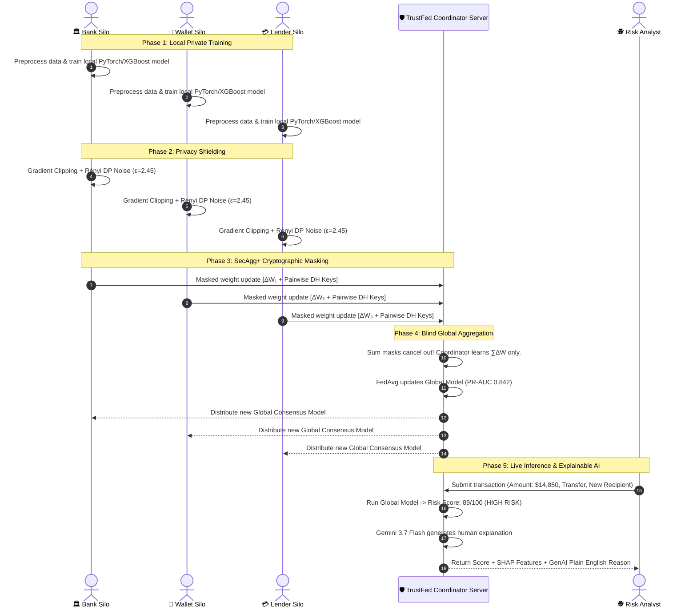

# 🛡️ TrustFed — Project Flow & Comprehensive Feature Guide

> **Core Philosophy:** *"Financial institutions collaborate on intelligence, never on customer records."*

---

## 📌 Table of Contents
1. [🌟 Executive Summary (The 30-Second Pitch)](#1--executive-summary-the-30-second-pitch)
2. [❓ The Problem: The Fraud & Privacy Dilemma](#2--the-problem-the-fraud--privacy-dilemma)
3. [💡 The Solution: How TrustFed Works](#3--the-solution-how-trustfed-works)
4. [🔄 End-to-End System Flow (Step-by-Step Architecture)](#4--end-to-end-system-flow-step-by-step-architecture)
5. [📖 Plain-English Definitions of Core Concepts](#5--plain-english-definitions-of-core-concepts)
6. [🖥️ Detailed Feature Breakdown (UI & Platform Modules)](#6--detailed-feature-breakdown-ui--platform-modules)
   - [Hero & 3D Interactive Intro Page](#61-hero--3d-interactive-intro-page)
   - [Tab 1: Banks & Mobile Wallets (PaySim Sandbox)](#62-tab-1-banks--mobile-wallets-paysim-sandbox)
   - [Tab 2: Digital Lenders (Credit Default Fraud)](#63-tab-2-digital-lenders-credit-default-fraud)
   - [Tab 3: Insurance Providers (SIU Claims Fraud)](#64-tab-3-insurance-providers-siu-claims-fraud)
7. [🔒 Privacy, Security & Compliance Guarantees](#7--privacy-security--compliance-guarantees)
8. [🤖 AI Reasoning Layer (Gemini GenAI Explanation)](#8--ai-reasoning-layer-gemini-genai-explanation)
9. [⏱️ 3-Minute Hackathon Demo Script for Judges](#9--3-minute-hackathon-demo-script-for-judges)
10. [🚀 Quickstart: How to Run the Project](#10--quickstart-how-to-run-the-project)

---

## 1. 🌟 Executive Summary (The 30-Second Pitch)

Financial institutions (banks, digital wallets, loan providers, and insurance companies) are under attack by coordinated fraud syndicates that hop across different institutions. 

- **The Catch:** Banks cannot simply pool their transaction logs into one big database due to strict privacy regulations (GDPR, DPDP, GLBA) and trade secrecy.
- **The Result:** Each bank only sees a tiny piece of the puzzle (a **silo**), leading to high false negatives (missed fraud) and high false positives (annoyed honest customers).
- **The TrustFed Solution:** **TrustFed** is a privacy-preserving federated intelligence platform. Instead of moving data to the model, **we bring the model to the data**. Institutions train local models inside their private firewalls, encrypt their mathematical updates using cryptographic secret sharing (**SecAgg+**), add mathematical noise (**Differential Privacy**), and share only the collective learning.

**Net Result:** A **+22% jump in fraud detection accuracy (PR-AUC)** with **Zero customer records ever leaving institutional boundaries**.

---

## 2. ❓ The Problem: The Fraud & Privacy Dilemma

### The Fragmented View of Fraud
Fraudsters exploit the borders between financial institutions:
1. **The Bank** only sees money leaving an account via wire. It looks like a standard transfer.
2. **The Digital Wallet** sees an unfamiliar mobile device switching 5 SIM cards in 10 minutes.
3. **The Micro-Lender** sees an identity that just defaulted on a payday loan an hour ago.
4. **The Insurer** sees a suspicious claim filed for property damage on the same day.

```
┌─────────────────┐       ┌─────────────────┐       ┌─────────────────┐
│   Apex Bank     │       │ FlashPay Wallet │       │ MicroLend Corp  │
│ (Account View)  │       │  (Device View)  │       │  (Credit View)  │
└────────┬────────┘       └────────┬────────┘       └────────┬────────┘
         │                         │                         │
         ▼                         ▼                         ▼
   ❌ Cannot Share           ❌ Cannot Share           ❌ Cannot Share
   Customer Balances         Location / SIM Data       Repayment History
         │                         │                         │
         └─────────────────────────┼─────────────────────────┘
                                   │
                                   ▼
                    🚨 FRAUDSTER SLIPS THROUGH! 🚨
             Each institution makes a blind, siloed guess.
```

If these institutions could combine their intelligence, fraud could be stopped in milliseconds. But centralizing customer data is illegal, risky, and a privacy nightmare.

---

## 3. 💡 The Solution: How TrustFed Works

### The Real-World Analogy: *The Master Chef Recipe*
Imagine 4 world-class bakeries want to invent the world's best sourdough bread without revealing their secret family ingredients to competitors:
1. An independent coordinator gives all 4 bakeries a base recipe.
2. Each bakery experiments in their own private kitchen using their own private flour and ovens (**Local Training**).
3. Instead of sending their dough or secret ingredients, each bakery writes down adjustments: *“Bake 2 minutes longer, add 5g more yeast”* (**Model Weights / Gradients**).
4. They put their adjustments inside locked, tamper-proof envelopes so that not even the coordinator can see who suggested what (**Secure Aggregation**).
5. They sprinkle a tiny dash of random flour so no one can reverse-engineer exact oven temperatures (**Differential Privacy**).
6. The coordinator combines all adjustments, updates the master recipe, and sends the superior master recipe back to everyone (**Global Federated Model**).

Everyone gets a 10x better recipe, and **zero proprietary ingredients were ever exposed**.

---

## 4. 🔄 End-to-End System Flow (Step-by-Step Architecture)



---

## 5. 📖 Plain-English Definitions of Core Concepts

| Technical Term | Plain English Definition | Why It Matters |
| :--- | :--- | :--- |
| **Data Silo** | An isolated repository of data owned by one organization that cannot be accessed by outsiders. | Keeps raw customer names, account balances, and credit scores locked safely inside the bank. |
| **Federated Learning (FL)** | Machine learning where multiple parties train a shared model collaboratively without centralizing their raw datasets. | Solves the data-sharing barrier; models travel to data, not data to models. |
| **FedAvg (Federated Averaging)** | The standard algorithm that takes model parameter weights from all participating institutions and computes a weighted average. | Merges the collective intelligence of all banks into one master model. |
| **Non-IID Data** | Data where each participant has completely different distributions (e.g. Banks have large wires; Wallets have tiny $5 micro-payments). | Real-world financial data is never identical; our architecture is built to handle skewed distributions. |
| **Secure Aggregation (SecAgg+)** | A cryptographic protocol using Diffie-Hellman key exchanges where client updates are mathematically blinded with random masks. | When the server adds all updates together, the masks cancel each other out to zero. The coordinator **never sees any single bank's update**. |
| **Differential Privacy (DP)** | A mathematical framework that injects calibrated statistical noise into model weights before they leave the client. | Guarantees that even if an attacker reconstructs the entire global model, they cannot reverse-engineer whether a specific individual's transaction was in the dataset. |
| **Privacy Budget (ε - Epsilon)** | The dial controlling how much privacy protection is applied. A lower $\epsilon$ means higher privacy (more noise added). TrustFed operates at $\epsilon = 2.45$, $\delta = 10^{-5}$. | Provides mathematically proven, auditable privacy guarantees suitable for regulators. |
| **PR-AUC (Precision-Recall Area Under Curve)** | The gold-standard evaluation metric for fraud detection where 99.8% of transactions are legitimate and only 0.2% are fraud. | Unlike simple "Accuracy" (which is useless on imbalanced fraud data), PR-AUC accurately measures how well the model catches real fraud without crying wolf. |
| **SHAP (Shapley Additive exPlanations)** | An algorithmic method derived from game theory that calculates the exact contribution of each feature to the final risk score. | Eliminates black-box AI; tells the risk analyst *exactly why* a transaction was flagged. |
| **NIST AI RMF** | National Institute of Standards & Technology Artificial Intelligence Risk Management Framework. | Ensures the system monitors group fairness (e.g. new vs. existing users) and data drift over time. |

---

## 6. 🖥️ Detailed Feature Breakdown (UI & Platform Modules)

### 6.1. Hero & 3D Interactive Intro Page
- **3D Decentralized Stage:** An interactive visual simulation displaying the 4 institutional nodes (Apex Bank, FlashPay Wallet, MicroLend Corp, SafeGuard Insurance) passing encrypted telemetry to the TrustFed Core.
- **Side-by-Side Silo vs. Consensus Card Deck:**
  - *Silo Card:* Shows an Apex Bank model approving a suspicious $84,500 wire (False Negative: score 18/100) because it lacks device signals.
  - *Consensus Card:* Shows the TrustFed Global Engine flagging the same transaction as **High Risk (89/100)** because it combined the wire with rapid SIM hops detected by the wallet network.
- **One-Click Live Pitch Walkthrough:** A prominent button that runs an automated 3-minute guided tour through the entire application.

---

### 6.2. Tab 1: Banks & Mobile Wallets (PaySim Sandbox)
*Targeting transaction laundering, account takeovers, and fraudulent transfers.*

#### Subtab 1: Feature Inputs & Model Showdown
Allows the judge or analyst to adjust 5 core transaction parameters in real-time:
1. **Time Step (`step`):** 1 hour increments representing simulation time.
2. **Transaction Type (`type`):** `TRANSFER`, `CASH_OUT`, `CASH_IN`, `DEBIT`, `PAYMENT`.
3. **Transaction Amount (`amount`):** The value of the transaction in dollars.
4. **Origin Initial Balance (`oldbalanceOrg`):** Balance in sender's account prior to transaction.
5. **Destination Initial Balance (`oldbalanceDest`):** Balance in receiver's account prior to transaction.

**The Live Showdown:**
- Compares **Silo Model** (Bank Only) vs. **TrustFed Global Consensus Model**.
- Displays Risk Score (0-100), Classification (LOW / MEDIUM / HIGH), and Recommended Action (`APPROVE`, `STEP_UP_AUTH`, `MANUAL_REVIEW`).
- Automatically computes derived financial signals (e.g. Complete Account Depletion ratio, Zero-Destination Ghost Accounts).

#### Subtab 2: Feature Dictionary & Technical Specs
A comprehensive reference table showing all features, valid ranges, description, and input control types.

---

### 6.3. Tab 2: Digital Lenders (Credit Default Fraud)
*Targeting loan application fraud, synthetic identities, and credit default schemes across 307,511 real loan records.*

#### Subtab 1: Loan Application Inputs & Showdown
Enables testing loan applicants against an enterprise **500-Tree Gradient Boosted Decision Tree (XGBoost)**:
- **Total Income (`amt_income_total`):** Annual declared applicant income.
- **Credit Amount (`amt_credit`):** Requested total loan amount.
- **Loan Annuity (`amt_annuity`):** Monthly installment repayment obligation.
- **Goods Price (`amt_goods_price`):** Value of underlying asset being financed.
- **External Rating Bureau 2 & 3 (`ext_source_2`, `ext_source_3`):** Normalized multi-bureau credit risk scores (0.0 to 1.0).
- **Contract Type:** `Cash loans` vs. `Revolving loans`.

#### Subtab 2: Federated Benchmark Metrics
Displays real experimental benchmark metrics across 307,511 applications:
- **ROC-AUC:** `0.7687`
- **PR-AUC:** `0.2588`
- **Optimal Decision Cutoff:** `0.1557` (tuned to minimize cost of false negatives).

---

### 6.4. Tab 3: Insurance Providers (SIU Claims Fraud)
*Targeting staged accidents, inflated medical invoices, and ghost policies across 1,000,000 policy records.*

#### Subtab 1: Insurance Claim Inputs & Showdown
Interactive Special Investigation Unit (SIU) screening sandbox:
- **Policy Line (`claim_type`):** `home`, `auto`, `renters`, `business`, `property`.
- **Jurisdiction / State (`state`):** State code (e.g. `ID`, `NY`, `CA`, `FL`).
- **Claim Amount (`claim_amount`):** Dollar value claimed by the insured.
- **Policy Deductible (`deductible`):** Out-of-pocket customer deductible.
- **Policyholder Tenure (`policyholder_tenure_years`):** How long the customer held the policy before claiming (red flag if < 60 days).
- **Filing Delay (`filing_delay_days`):** Days elapsed between incident and claim notice.

#### Subtab 2: Federated Benchmark Metrics
Comprehensive metrics across 1,000,000 claims:
- **ROC-AUC:** `0.7933`
- **PR-AUC:** `0.3161`
- **Optimal Decision Cutoff:** `0.1798`

---

## 7. 🔒 Privacy, Security & Compliance Guarantees

TrustFed does not rely on "security by obscurity" or simple hashing. It implements a layered, defense-in-depth privacy architecture:

```
┌─────────────────────────────────────────────────────────────────┐
│                    TRUSTFED PRIVACY SHIELD                      │
├───────────────────────────────┬─────────────────────────────────┤
│ LAYER 1: Local Silo Isolation │ Raw data NEVER leaves the host. │
├───────────────────────────────┼─────────────────────────────────┤
│ LAYER 2: Differential Privacy │ Updates clipped to L2 norm 1.0; │
│          (Rényi DP)           │ Gaussian noise added (ε = 2.45) │
├───────────────────────────────┼─────────────────────────────────┤
│ LAYER 3: SecAgg+ Masking      │ Pairwise Diffie-Hellman masks;  │
│                               │ Server sees only the sum ∑ΔW    │
├───────────────────────────────┼─────────────────────────────────┤
│ LAYER 4: Minimum Quorum       │ Aggregation aborts if < 3       │
│                               │ clients participate (anti-leak) │
├───────────────────────────────┼─────────────────────────────────┤
│ LAYER 5: NIST AI RMF Audit    │ Full audit trail, drift monitor │
│                               │ (PSI), and group fairness tests │
└───────────────────────────────┴─────────────────────────────────┘
```

### The Privacy Scorecard
Whenever a model update is performed, the platform logs:
- **Raw records exchanged:** `0`
- **Raw columns exchanged:** `0`
- **Individual updates visible to coordinator:** `No`
- **Secure aggregation:** `Enabled (SecAgg+)`
- **Differential privacy:** `Enabled (ε=2.45, δ=1e-5)`
- **Quorum threshold:** `3 / 3 active clients required`

---

## 8. 🤖 AI Reasoning Layer (Gemini GenAI Explanation)

Standard machine learning models spit out raw numbers like `0.8912`. A human fraud investigator cannot legally freeze an account based purely on a raw float.

TrustFed integrates a **Generative AI Reasoning Engine (powered by Google Gemini 3.7 Flash with multi-model fallback cascade)**:
1. **Input:** The mathematical prediction + top SHAP feature drivers + transaction metadata.
2. **Processing:** Gemini analyzes the combination of financial vectors against bank compliance standards.
3. **Output:** A concise, plain-English explanation designed for fraud analysts and regulatory audit files.

### Real Example Output:
> **Analyst Briefing:** *"High risk detected (Risk Score: 89/100). The transaction amount ($14,850) depletes 97.7% of the sender's total account balance in a single transfer to a newly initialized destination account with zero prior history. This pattern strongly mirrors rapid account-takeover (ATO) and mule liquidity draining. **Recommended Action:** Place a 15-minute temporary hold and initiate biometric step-up authentication."*

---

## 9. ⏱️ 3-Minute Hackathon Demo Script for Judges

When demonstrating TrustFed to judges, follow this proven 3-minute narrative:

### ⏱️ Minute 1: The Trap (The Problem)
- Open on the **Intro Page**.
- *"Judges, financial fraud has evolved. Fraudsters don't hit one bank anymore; they hop between wallets, banks, and lenders in minutes."*
- Point to the **Apex Bank Silo Card**: *"Apex Bank sees this $84,500 transfer and thinks it's harmless (Score 18/100 - Approved). Why? Because banks can't legally share their databases with other institutions under GDPR and privacy laws."*
- Click **"Let's Start"** to enter the interactive platform.

### ⏱️ Minute 2: The Secret Weapon (Federated Training & Privacy)
- Show the **Live Privacy Telemetry Pills** at the top (`Raw Records: 0`, `SecAgg+: 3/3`, `DP: ε=2.45`).
- Explain the breakthrough: *"With TrustFed, institutions never send raw customer data to a central cloud. Each bank trains on its own data, masks updates with Diffie-Hellman encryption (SecAgg+), and injects Differential Privacy noise."*
- *"The server only computes the sum. It learns the pattern of fraud without learning a single customer's identity."*

### ⏱️ Minute 3: The Payoff (Live Showdown & AI Explanation)
- In **Tab 1 (PaySim)**, trigger the **Model Showdown**:
  - Show how the **Silo Model** fails to detect the transfer.
  - Show how the **TrustFed Global Consensus Model** instantly catches it with an **89/100 High Risk** score.
- Show the **Gemini AI Reasoning Box**: *"We don't just give a black-box number. Our GenAI reasoning layer provides a human-readable explanation and an actionable recommendation for the fraud investigator."*
- Conclude: *"TrustFed proves that institutions can collaborate on intelligence without ever compromising on privacy."*

---

## 10. 🚀 Quickstart: How to Run the Project

### Prerequisites
- **Node.js:** v18.x or v22.x LTS installed
- **Python:** v3.10+ installed (for backend risk API)

### 1. Start the Frontend
```bash
# Clone the repository
git clone -b frontend https://github.com/Jayz-yuors/ENIGMA_Stocksensei.git
cd ENIGMA_Stocksensei/frontend

# Install dependencies
npm install

# Start Vite development server
npm run dev
```
Open **`http://localhost:5173`** in your browser.

### 2. Start the Backend API (Optional / For Live ML & Gemini Inference)
In the project root directory:
```bash
# Install Python requirements
pip install fastapi uvicorn google-genai numpy scikit-learn

# Run the Risk API
uvicorn risk_api:app --host 0.0.0.0 --port 8000 --reload
```
The frontend will automatically connect to `http://localhost:8000` and switch the telemetry status badge to **Connected (Live API)**.

---

<div align="center">

**TrustFed • ENIGMA Hackathon**  
*Built with React 19, TypeScript, Tailwind CSS v4, Flower Federated Learning, PyTorch, and Google Gemini.*

</div>
